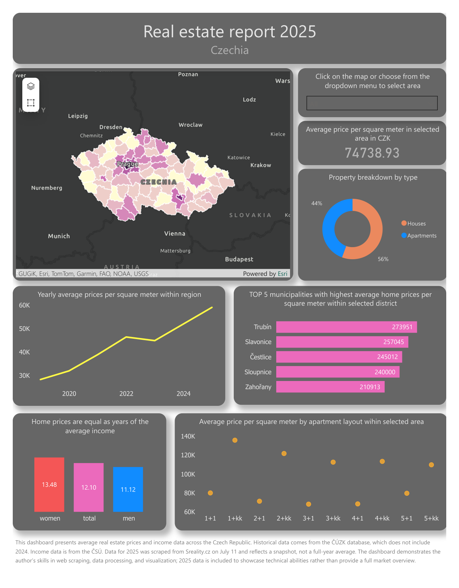
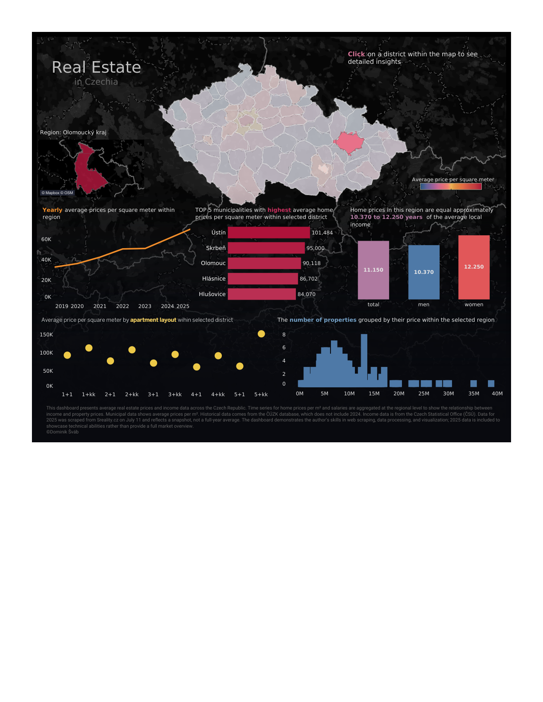

# 🏠 Czech Real Estate Market Analysis

> An end-to-end data analytics project exploring residential property prices across the Czech Republic — from web scraping and SQL transformation to interactive Power BI and Tableau dashboards.


This repository is part of my data portfolio and demonstrates the full analytics
workflow: **data acquisition → cleaning & transformation → storage → visualization.**

---

## 📊 Dashboard Preview

| Power BI | Tableau |
| :---: | :---: |
|  |  |

▶️ **Try the interactive Tableau version:** [Czechia Dashboard on Tableau Public](https://public.tableau.com/views/Czechia_dashboard/Dashboard1?:language=en-US&:origin=viz_share_link)

🌐 **Live HTML dashboard (no login, opens in any browser):** [domin224.github.io/czechia_real_estate](https://domin224.github.io/czechia_real_estate/) — self-contained, built directly from the cleaned data in this repo.

> ℹ️ **AI-assisted build:** the interactive web dashboard was created with the help of AI (Claude), which reworked my Power BI / Tableau dashboards into a single self-contained, interactive web page (Leaflet map + Chart.js), driven directly by the project's cleaned data.

---

## 📑 Table of Contents

- [Overview](#-overview)
- [Key Questions](#-key-questions)
- [Tech Stack](#-tech-stack)
- [Project Structure](#-project-structure)
- [Data Sources](#-data-sources)
- [Workflow](#-workflow)
- [Getting Started](#-getting-started)
- [Outputs](#-outputs)
- [Disclaimer](#-disclaimer)
- [License](#-license)
- [Author](#-author)

---

## 🔎 Overview

- **Data Scraping** — Automated collection of real estate listings from the public
  [Sreality.cz](https://www.sreality.cz) API (apartments and houses for sale).
- **Data Collection** — Manually gathered public data from the Czech Statistical
  Office (ČSÚ) and the Czech Office for Surveying, Mapping and Cadastre (ČÚZK):
  population, average wages, and district/municipality spatial boundaries.
- **Cleaning & Transformation** — Performed with SQL, Excel and Power Query
  (deduplication, formatting, derived metrics such as price per m²).
- **Storage** — Data is loaded into a PostgreSQL database and modelled for analysis.
- **Visualization** — Interactive dashboards in Power BI and Tableau, plus static
  PDF reports.

## ❓ Key Questions

This project explores questions such as:

- How do average property prices per m² differ across regions and districts?
- Which districts have the highest home prices relative to local income?
- How many years of average income are needed to afford a typical home?
- How have prices developed over time (historical ČÚZK data vs. a 2025 snapshot)?

## 🛠 Tech Stack

| Layer | Tools |
| --- | --- |
| Data acquisition | Python (`requests`, `pandas`, `geopandas`, `shapely`) |
| Transformation | SQL (PostgreSQL), Excel / Power Query |
| Storage | PostgreSQL |
| Visualization | Power BI Desktop, Tableau Public |

## 📁 Project Structure

```
czechia_real_estate/
├── src/                       # Python scripts
│   ├── sreality_scraper.py    # Scrapes listings from the Sreality.cz API
│   └── assigner.py            # Spatial join: assigns RÚIAN codes to listings
├── sql/
│   └── project_script.sql     # SQL cleaning & transformation queries
├── dashboards/                # Power BI & Tableau workbooks + PDF exports
│   ├── powerbi_dashboard.pbix
│   ├── powerbi_dashboard.pdf
│   ├── tableau_dashboard.twb
│   └── tableau_dashboard.pdf
├── data/
│   └── csv_tables.zip         # Final cleaned data tables (CSV)
├── docs/                      # GitHub Pages site + preview images
│   └── index.html             # Self-contained interactive HTML dashboard
├── requirements.txt
├── LICENSE
└── README.md
```

## 🗂 Data Sources

| Source | Data | Access |
| --- | --- | --- |
| [Sreality.cz](https://www.sreality.cz) | Property listings (price, size, disposition, GPS) | Scraped via API |
| [Czech Statistical Office (ČSÚ)](https://www.czso.cz) | Average wages, population by district | Manual download |
| [ČÚZK / RÚIAN](https://vdp.cuzk.cz/vdp/ruian/vymennyformat) | Region, district & municipality boundaries | Manual download |

## 🔄 Workflow

1. **Acquire** — Scrape current listings with `sreality_scraper.py`; download the
   demographic and geographic datasets from ČSÚ and ČÚZK.
2. **Geo-enrich** — Run `assigner.py` to spatially join listings to municipalities
   and attach RÚIAN / NUTS-LAU codes.
3. **Transform** — Load the raw CSVs into PostgreSQL and run the queries in
   `sql/project_script.sql` (price per m², income-to-price ratios, historical
   table, etc.). Use Excel / Power Query for any additional shaping.
4. **Visualize** — Connect Power BI to PostgreSQL (or load the CSVs into Tableau)
   and explore the dashboards.

## 🚀 Getting Started

### Prerequisites

- [Python 3.10+](https://www.python.org/downloads/)
- [PostgreSQL 15+](https://www.postgresql.org/)
- [DBeaver](https://dbeaver.io/) (optional, for running SQL scripts)
- [Power BI Desktop](https://powerbi.microsoft.com/en-us/desktop/) and/or
  [Tableau Public](https://public.tableau.com/)

### Installation

```bash
git clone https://github.com/domin224/czechia_real_estate.git
cd czechia_real_estate

# (recommended) create a virtual environment
python -m venv .venv
source .venv/bin/activate        # Windows: .venv\Scripts\activate

pip install -r requirements.txt
```

### Usage

```bash
# 1. Scrape listings (adjust the number of API pages as needed)
python src/sreality_scraper.py --max-pages 100

# 2. Assign municipality / RÚIAN codes via a spatial join
python src/assigner.py \
    --input reality_houses.csv \
    --municipalities obce_polygony.geojson \
    --output input_with_ruian.csv
```

Then load the resulting CSVs into PostgreSQL and run `sql/project_script.sql`.

> 💡 **Tip:** DBeaver makes it easy to import the CSVs into staging tables and
> execute the SQL transformation scripts.

## 📦 Outputs

- **Interactive dashboards**
  - [Live HTML dashboard (GitHub Pages)](https://domin224.github.io/czechia_real_estate/) — self-contained, built from this repo's data
  - [Tableau Public (hosted)](https://public.tableau.com/views/Czechia_dashboard/Dashboard1?:language=en-US&:origin=viz_share_link)
  - Power BI workbook: [`dashboards/powerbi_dashboard.pbix`](dashboards/powerbi_dashboard.pbix)
  - Tableau workbook: [`dashboards/tableau_dashboard.twb`](dashboards/tableau_dashboard.twb)
- **Static reports (PDF)**
  - [`dashboards/powerbi_dashboard.pdf`](dashboards/powerbi_dashboard.pdf)
  - [`dashboards/tableau_dashboard.pdf`](dashboards/tableau_dashboard.pdf)
- **Final data tables** — [`data/csv_tables.zip`](data/csv_tables.zip)

## ⚠️ Disclaimer

This project presents average real estate prices and income data across the Czech
Republic. Historical data comes from the ČÚZK database, which does not include 2024.
Data for 2025 was scraped from Sreality.cz on **11 July** and reflects a snapshot,
not a full-year average. The project demonstrates skills in web scraping, data
processing, and visualization; the 2025 data is included to showcase technical
ability rather than to provide a complete market overview.

All data was collected from publicly available sources and is used for educational
and portfolio purposes only.

## 📄 License

Released under the [MIT License](LICENSE).

## 👤 Author

**Dominik Šváb** — [@domin224](https://github.com/domin224)

For any questions, feel free to reach out.
